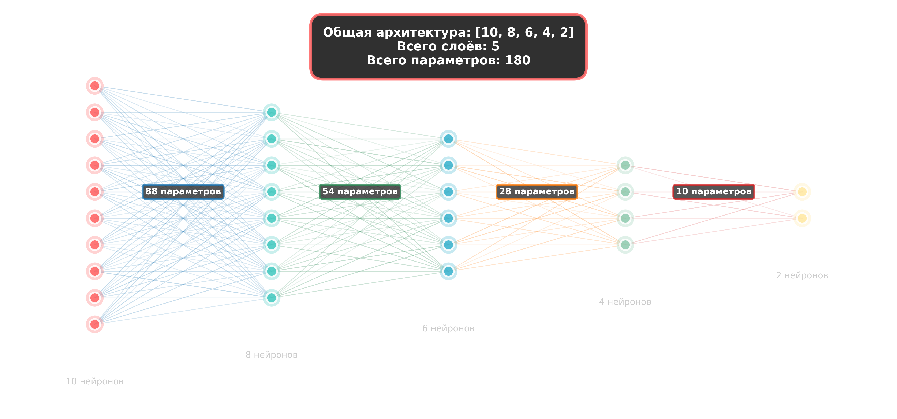

# Telegram-бот для распознавания текста на изображениях с использованием нейросетей

### Направление деятельности
Программирование и алгоритмизация. В основе проекта лежит исследование и практическая реализация технологии оптического распознования символов (`OCR - Optical Character Recognition`):
1. **Исследовательская часть**: Изучение архитектур нейронных сетей, применяемых для компьютерного зрения, в частности для распознования текста с изображения.
2. **Программная часть**: Разработка программы на языке программирования `Python`, которая интегрирует предобученную модель распознования слов на изображении в месседжер `Telegram`, добавляя собственный алгоритм постобработки для группировки слов в читаемые строки.

### Проблема
В выбранном направлении для создания эффективной системы распознования текста необходимо было решить следующие ключевые проблемы:
1. **Проблема выбора архитектуры**: Какие алгоритмы и комбинации нейронных сетей (свёрточные, рекуррентные) наиболее эффективны для задачи оптического распознования символов.
2. **Проблема вычислительных ресурсов**: Как реализовать точное распознование, не имея доступа к мощным серверам с `GPU` для обучения сложных моделей с нуля. Требовалось найти баланс между качеством и производительностью на обычном компьютере.
3. **Проблема интеграции**: Как объеденить работу готовой модели машинного обучения с внешней платформой `Telegram`, чтобы создать удобный и доступный интерфейс для пользователя, а не просто демонстрацию технологии.

### Сфера и использования и полезность продукта
Он будет помогать пользователям быстро и удобно извлекать текстовую информацию с изображений, что полезно для:
- **Студентов и школьников**: чтобы быстро перенести в цифровой вид текст с фотографии учебника, распечатки или доски.
- **Сотрудников в офисе**: для оцифровки текста с документов, визиток или скриншотов без необходимости перепечатывать всё вручную.
- **Любого пользователя**: для мгновенного перевода текста на фото (при подключении переводчика) или для быстрого копирования цитаты из поста в социальных сетях, сохранённого в виде картинки или для извлечения информации с видео, сохранив кадр.

### Актуальность проекта
Проект актуален по трём причинам:
1. **Технологическая**: Нейросети и компьютерное зрение - ключевые технологии современности. Практическое применение `OCR` востребовано везде.
2. **Практическая**: Вручную перепечатывать текст с фото, документов или экрана - медленно. Людям нужен простой и быстрый инструмент для оцифровки текста прямо в месседжере.
3. **Образовательная**: Проект показывает, как сложные технологии превращаются в лёгкий и понятный инструмент, давая ценный опыт прикладного программирования.

### Руководитель проекта
Учитель информатики Мешанина Олеся Сергеевна.

### Гипотеза
> Использование готовой предобученной модели машинного обучения `EasyOCR` является более эффективным подходом для создания практического сервиса распознавания текста, чем самостоятельная разработка и обучение модели с нуля, так как оно позволяет существенно лучше распозновать контект с изображений за счёт большей вычислительной мощности на момент обучения модели.

### Продукт
Рабочий `Telegram` бот (`@CopyTextsBot`), который:
1. Принимает от пользователя изображение.
2. Автоматически распознаёт на нём текст на русском языке.
3. Возвращает пользователю готовый текстовый блок.
Что демонстрируется:
- Факт работы: живой бот в месседжере.
- Резульатат: точность распознования на примере разных изображений.
- Код: программа на языке программирования `Python`, реализующая логику бота.

### Тема
> Telegram-бот для распознавания текста на изображениях с использованием нейросетей

### Цель проекта
1. **Разработать и реализовать работоспособного `Telegram-бота`**, способного автоматически распозновать текстовую информацию с загружаемых пользователем изображений.
2. **Исследовать и применить на практике современные подходы к распознованию текста** на основе нейронных сетей, оценив эффективность использования готовых `OCR-решений` для создания прикладных сервисов.

## Ход работы
#### Введение в нейронные сети
Перед тем как перейти к описанию практической реализации проекта, важно понять основную технологию, лежащую в его основе — **искусственные нейронные сети (ИНС)**.

#### Что такое нейронная сеть?
Проще говоря, нейронная сеть — это математическая модель, вдохновленная работой человеческого мозга. Её основная задача — находить сложные зависимости и закономерности в данных (например, на изображениях, в тексте или числах), чтобы на основе этого делать прогнозы или принимать решения.

#### Ключевая аналогия: Ребенок и кошка
Представьте, что вы учите маленького ребенка распознавать кошку.
1. Вы не объясняете ему сложных правил (есть усы, хвост, четыре лапы).
2. Вы просто показываете много разных картинок с кошками и без них, каждый раз говоря: «Это кошка», «Это не кошка».
3. Мозг ребенка сам, методом проб и ошибок, выявляет закономерности — какие сочетания форм, цветов и деталей соответствуют понятию «кошка».
4. Чем больше примеров он увидит, тем точнее будет его распознавание, даже если он встретит кошку необычной породы или в странной позе.

#### Нейронная сеть обучается точно так же.
- **Данные — это примеры**. Вместо картинок с кошками мы даем сети тысячи изображений с текстом и соответствующие им текстовые метки.
- **Обучение — это процесс настройки**. Сеть начинает делать предположения, сравнивает их с правильным ответом и постепенно **настраивает внутренние параметры** (так называемые «веса»), чтобы уменьшать количество ошибок.
- **Результат — это обобщение**. После обучения сеть не просто запоминает примеры, а выучивает общие принципы: как выглядят буквы «А», «Б», «В» в разных шрифтах, размерах и условиях освещения.

#### Из чего состоит эта «сеть»?
Базовый строительный блок — **нейрон**. Его можно представить как маленькую фабрику, которая:
1. **Получает** на вход несколько сигналов (например, данные о яркости пикселей изображения).
2. **Взвешивает** их (определяет, насколько важен каждый сигнал).
3. **Суммирует** взвешенные сигналы.
4. **Принимает решение**, достаточно ли сильная эта сумма, чтобы «активироваться» и передать сигнал дальше.

Сотни тысяч таких нейронов объединяются в слои:
- **Входной слой** получает исходные данные (пиксели изображения).
- **Скрытые слои** — это «мозг» сети. Именно в них происходят сложные вычисления по поиску закономерностей. Чем больше слоев, тем более сложные зависимости может обнаружить сеть (такие сети называют «глубокими»).
- **Выходной слой** выдает конечный результат (например, распознанную букву).

#### Почему это применимо к распознаванию текста?
Задача распознавания текста на изображении идеально подходит для нейронных сетей, потому что:
1. Это **сложно прописать вручную**. Невозможно написать простые правила для всех шрифтов, поворотов, освещения и повреждений текста.
2. Есть **огромное количество данных**. Миллионы изображений с текстом можно использовать для обучения.
3. Нейронная сеть может **научиться игнорировать лишнее**: фон, тени, узоры — и концентрироваться именно на контурах символов и слов.

## 1. Многослойный перцептрон (MLP)
### 1.1. Основная концепция и архитектура
Многослойный перцептрон `Multi-Layer Perceptron, MLP` — это класс искусственных нейронных сетей прямого распространения `feedforward neural networks`, состоящий из множества слоев нейронов. В отличие от однослойного перцептрона, `MLP` способен решать нелинейные задачи благодаря наличию скрытых слоев.

#### Базовая архитектура:
- **Входной слой** `Input Layer`: получает исходные данные
- **Скрытые слои** `Hidden Layers`: выполняют основную обработку информации
- **Выходной слой** `Output Layer`: формирует конечный результат

Каждый нейрон в слое соединен со всеми нейронами следующего слоя (полносвязная сеть).

<div align="center">
  <figure>
    
    <figcaption><em>Рис. 1: Архитектура MLP сети</em></figcaption>
  </figure>
</div>

### 1.2. Математическая модель одного нейрона
Рассмотрим $i$ нейрон в l-м слое:

#### Входные сигналы:
$$
z_i^l = \sum_{j=1}^{n} \left[ w_{ij}^l \cdot a_j^{(l-1)} \right] + b_i^l
$$

где:
- $z_i^l$ - взвешенная сумма для нейрона $i$ в слое $l$
- $w_{ij}^l$ - вес связи между $j$-м нейроном слоя $l-1$ и $i$-м нейроном слоя $l$
- $a_j^{(l-1)}$ - активация $j$-го нейрона предыдущего слоя $(l-1)$
- $b_i^l$ - смещение (*bias*) $i$-го нейрона в слое $l$
- $n$ - количество нейронов в предыдущем слое $(l-1)$

#### Функция активации:
$$
a_i^l = \varphi(z_i^l)
$$

где:
- $a_i^l$ - активация (выходное значение) нейрона $i$ в слое $l$
- $\varphi$ - функция активации
- $z_i^l$ - взвешенная сумма входов нейрона $i$ в слое $l$

### 1.3. Популярные функции активации
#### 1. Сигмоида (Sigmoid)

**Функция:**

$$
\varphi(x) = \frac{1}{1 + e^{-x}}
$$

**Производная:**

$$
\varphi'(x) = \varphi(x) \cdot (1 - \varphi(x))
$$

#### 2. Гиперболический тангенс (Hyperbolic Tangent)

**Функция:**

$$
\tanh(x) = \frac{e^x - e^{-x}}{e^x + e^{-x}}
$$

**Производная:**

$$
\tanh'(x) = 1 - \tanh^2(x)
$$

#### 3. ReLU (Rectified Linear Unit)

**Функция:**

$$
\text{ReLU}(x) = \max(0, x)
$$

**Производная:**

$$
\text{ReLU}'(x) = \begin{cases}
1 & \text{если } x > 0 \\
0 & \text{иначе}
\end{cases}
$$

### 1.4. Прямое распространение (Forward Propagation)
Процесс вычисления выхода сети для заданного входа:

**Алгоритм**:
1. Инициализация: $a¹ = x$ (входной вектор)
2. Для каждого слоя $l = 2$ до $L$:

$$
z^l = W^l \cdot a^{(l-1)} + b^l
$$

$$
a^l = φ(z^l)
$$

где:
- $z^l$ - вектор взвешенных сумм слоя $l$
- $W^l$ - матрица весов слоя $l$
- $a^{(l-1)}$ - вектор активаций предыдущего слоя $(l-1)$
- $b^l$ - вектор смещений слоя $l$
- $φ$ - функция активации (применяется поэлементно)

3. Результат: $y_pred = a^L$

где:
- $W^l$ — матрица весов слоя $l$
- $b^l$ — вектор смещений слоя $l$
- $L$ — количество слоев

### 1.5. Функция потерь (Loss Function)
Для оценки ошибки сети используется функция потерь. Для задачи регрессии — среднеквадратичная ошибка (MSE):

$$
J(W,b) = \frac{1}{2m} \sum_{i=1}^{m} \lVert \hat{y}^{(i)} - y^{(i)} \rVert ^2
$$

Для задачи классификации — перекрестная энтропия:

$$
J(W,b) = -\frac{1}{m} \sum_{i=1}^{m} \left[ y^{(i)} \log(\hat{y}^{(i)}) + (1 - y^{(i)}) \log(1 - \hat{y}^{(i)}) \right]
$$

### 1.6. Обратное распространение ошибки (Backpropagation)
**Цель**: вычислить градиенты функции потерь по параметрам сети для их последующего обновления.

**Обозначения:**
- $δ_i^l$ — ошибка $i$-го нейрона в слое $l$
- $\frac{\partial J}{\partial w_{ij}^l}$ - градиент по весу $w_{ij}^l$
- $\frac{\partial J}{\partial b_i^l}$ - градиент по смещению $b_i^l$

**Алгоритм:**
1. **Вычисление ошибки выходного слоя:**

$$
\delta^{L} = \nabla_{a}J \odot \varphi'(z^{L})
$$

где $⊙$ — поэлементное умножение (Hadamard product)

2. **Обратное распространение по слоям ($l = L-1$ до $2$):**

$$
\delta^{l} = ((W^{(l+1)})^T \delta^{(l+1)}) \odot \varphi'(z^{l})
$$

3. **Вычисление градиентов:**

$$
\frac{\partial J}{\partial w_{ij}^{l}} = a_j^{(l-1)} \delta_i^{l}
$$

$$
\frac{\partial J}{\partial b_i^{l}} = \delta_i^{l}
$$

### 1.7. Обучение сети (градиентный спуск)

**Обновление параметров:**

$$
w_{ij}^{l} = w_{ij}^{l} - \alpha \frac{\partial J}{\partial w_{ij}^{l}}
$$

$$
b_i^{l} = b_i^{l} - \alpha \frac{\partial J}{\partial b_i^{l}}
$$

где $α$ — скорость обучения `learning rate`

**Пакетный градиентный спуск (Batch Gradient Descent):**
- Использует весь набор данных для одного обновления
- Стабильная сходимость, но медленная для больших dataset ов

**Стохастический градиентный спуск (Stochastic Gradient Descent):**
- Обновление после каждого примера
- Быстрая сходимость, но высокая дисперсия

**Батчевый градиентный спуск (Mini-batch Gradient Descent):**
- Компромиссный вариант `batch size = 32-512`
- Наиболее популярный на практике

### 1.8. Практические аспекты и проблемы
**Проблема исчезающих градиентов:**
В глубоких сетях с сигмоидой/tanh градиенты могут становиться очень маленькими, что останавливает обучение.

**Решения:**
- Использование `ReLU`-активаций
- Инициализация весов (`Xavier`, `He`)

**Переобучение (Overfitting):**
Сеть запоминает обучающие данные, но плохо обобщает.

**Методы борьбы:**
- Встряска весов (`Dropout`)
- Ранняя остановка (`early stopping`)
- Увеличение данных (`data augmentation`)

### 1.9. Пример реализации

```python
import numpy as np

class MLP:
    def __init__(self, layers):
        self.layers = layers
        self.weights = []
        self.biases = []
        
        for i in range(len(layers) - 1):
            w = np.random.randn(layers[i + 1], layers[i]) * 0.1
            b = np.zeros((layers[i + 1], 1))
            self.weights.append(w)
            self.biases.append(b)
    
    def sigmoid(self, x):
        return 1 / (1 + np.exp(-x))
    
    def sigmoid_derivative(self, x):
        return x * (1 - x)
    
    def forward(self, x):
        self.activations = [x]
        self.z_list = []
        
        activation = x
        for w, b in zip(self.weights, self.biases):
            z = np.dot(w, activation) + b
            activation = self.sigmoid(z)
            self.z_list.append(z)
            self.activations.append(activation)
        
        return activation
    
    def backward(self, x, y, lr):
        m = x.shape[1]
        
        delta = (self.activations[-1] - y) * self.sigmoid_derivative(self.activations[-1])
        
        for i in range(len(self.layers) - 2, -1, -1):
            dw = np.dot(delta, self.activations[i].T) / m
            db = np.sum(delta, axis=1, keepdims=True) / m
            
            self.weights[i] -= lr * dw
            self.biases[i] -= lr * db
            
            if i > 0:
                delta = np.dot(self.weights[i].T, delta) * self.sigmoid_derivative(self.activations[i])
    
    def train(self, x, y, epochs, lr):
        for epoch in range(epochs):
            output = self.forward(x)
            self.backward(x, y, lr)
            loss = np.mean((output - y) ** 2)
            print(f"\rEpoch {epoch}, Loss: {loss:.6f}", end="")
    
    def save_model(self, path):
        model_dict = {
            'layers': self.layers,
            'weights': self.weights,
            'biases': self.biases
        }
        np.savez(path, **model_dict)
    
    def load_model(self, path):
        data = np.load(path)
        self.layers = data['layers']
        self.weights = list(data['weights'])
        self.biases = list(data['biases'])
```

### 1.10. Тестирование

Для обучения модели необходимо: 
- Иметь 2 типа паттернов для обучения: положительные примеры и отрицательные примеры. Так как MLP модель на вход принимает фиксированный размер входных данных, то ими будет массив изображения разрешением 20x20px с изображёнными на них символами из указанного алфавита. 
- Алфавит состоящий из кириллицы, представленный в обоих регистрах, и цифры со специальными символами: `АБВГДЕЁЖЗИЙКЛМНОПРСТУФХЦЧШЩЪЫЬЭЮЯабвгдеёжзийклмнопрстуфхцчшщъыьэюя0123456789.,;:!?()-«»`
- Множество шрифтов для кириллицы, помещённые в папку `fonts`
- Случайные изображения в папке `trash` для генерации отрицательных паттернов

**Пример кода для генерации датасета для обучения нейросети:**
```python
from PIL import Image, ImageDraw, ImageFont
import numpy as np
import os

SYMBOLS = [i for i in "АБВГДЕЁЖЗИЙКЛМНОПРСТУФХЦЧШЩЪЫЬЭЮЯабвгдеёжзийклмнопрстуфхцчшщъыьэюя0123456789.,;:!?()-«»"]
FONTS = os.listdir("fonts")
TRASH = os.listdir("trash")

if __name__ == "__main__":
    x, y = [], []
    done = 1

    for file in TRASH:
        trash_img = Image.open(os.path.join("trash", file)).convert("L")
        w, h = trash_img.size

        for _ in range(1000):
            while True:
                x0 = np.random.randint(0, w - 60 + 1)
                y0 = np.random.randint(0, h - 60 + 1)
                img = trash_img.crop((x0, y0, x0 + 60, y0 + 60))
                img = img.resize((20, 20))

                arr = np.array(img)
                arr = (arr > 100).astype(np.uint8)

                if 0 < arr.sum() <= 0.9 * arr.size:
                    x.append(arr.flatten())
                    y.append("trash")

                    print(f"\r{done}/{len(TRASH) * 1000}", end="")
                    done += 1

                    break

    print()
    done = 1

    for symbol in SYMBOLS:
        for font in FONTS:
            font = ImageFont.truetype(os.path.join("fonts", font), 25)
            img = Image.new("L", (40, 40), color=0)
            draw = ImageDraw.Draw(img)
            draw.text((10, 10), symbol, font=font, fill=255)
            img = img.crop(img.getbbox())
            img = img.resize((20, 20))

            arr = np.array(img)
            arr = (arr > 100).astype(np.uint8)
            x.append(arr.flatten())
            y.append(symbol)

            print(f"\r{done}/{len(SYMBOLS) * len(FONTS)}", end="")
            done += 1

    x = np.array(x, dtype=np.uint8)
    y = np.array(y)

    np.savez("dataset.npz", x=x, y=y)

    print()
```

**Создай окружение `venv`:**
```
python3 -m venv venv
```
**Активируй `venv`**
```
source venv/bin/activate
```
**Запусти код**
```
python dataset.py
```
**После завершения кода, в `dataset.npz` будут все паттеры для обучения**

**Код для обучения модели:**
```python
import numpy as np
from mlp_model import MLP

data = np.load("dataset.npz")
x = data['x'].T
y_data = data['y']

symbols = np.unique(y_data)
num_classes = len(symbols)

y = np.zeros((num_classes, len(y_data)))
for i, symbol in enumerate(symbols):
    y[i, y_data == symbol] = 1

x = x.astype(np.float32) / 255.0

model = MLP([400, 128, 64, num_classes])

model.train(x, y, epochs=100, lr=0.1)

model.save_model("model.npz")
```

**Запусти обучение:**
```
python train.py
```
**После завершения обучения, модель сохраниться в `model.npz`**
